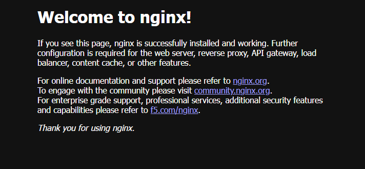

### What you will learn

- Container ports
- Host ports
- Port publishing
- Host-to-container access

### Tasks

Run: `nginx:alpine`  and make the Nginx HTTP service accessible from your machine.

### Requirements

1. Run an Nginx container.
2. Publish the container's HTTP port to a host port of your choice.
3. Give the container a meaningful name.
4. Verify the port mapping.
5. Open the Nginx welcome page from the host.
6. Stop and remove the container.

### Verification

The Nginx page must be reachable from your browser or HTTP client.

### Resolutions
- **`*docker run -d --name ngnixcontainer -p 1000:80 nginx:latest*`**
- **`*docker images*`**
- **`*docker ps*`**
- **`*docker ps -a*`**
- **`*docker stop ngnixcontainer*`**
- **`*docker rm ngnixcontainer*`**

